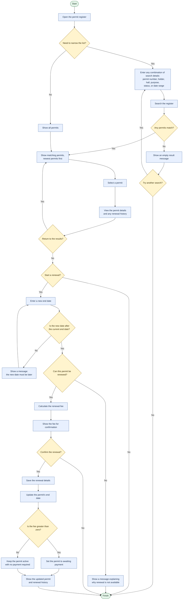

# Business flowchart: search, view and renew a permit

Audience: Riverside Council Permits Officers

## Business rules shown in the flow

- All search details are optional.
- Holder name searches can use part of the name and ignore capitalisation.
- Results show the permit number, holder, hall, purpose, status, dates, and fee.
- A renewal date must be later than the current end date.
- Only an active permit, or an expired permit within 90 days of its end date, can be renewed.
- The renewal fee uses the hall's daily rate and is capped at 30 days.
- Council Use renewals have no fee and do not require payment.
- A chargeable renewal changes the permit to awaiting payment after confirmation.
- The renewal is not saved until the officer confirms the displayed fee.
